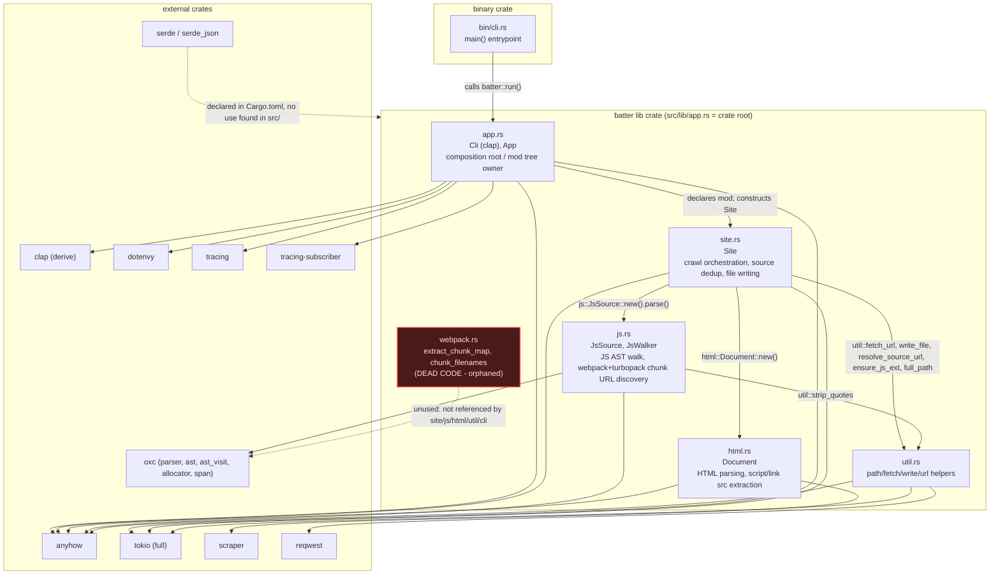

# Component Diagram

## Notes

Produced independently by a fresh agent reading the repository directly, with no
communication with the agents that produced the class or sequence diagrams.

Two dead/unused points identified:
- `webpack.rs` is declared as a module in `app.rs` but its public functions
  (`extract_chunk_map`, `chunk_filenames`) are never called anywhere — its
  chunk-map-extraction responsibility was reimplemented and extended (to also
  cover Turbopack) directly inside `js.rs`'s `JsWalker`.
- `serde`/`serde_json` are declared as dependencies in `Cargo.toml` but no
  `use serde` or `#[derive(Serialize/Deserialize)]` appears anywhere in `src/`.
